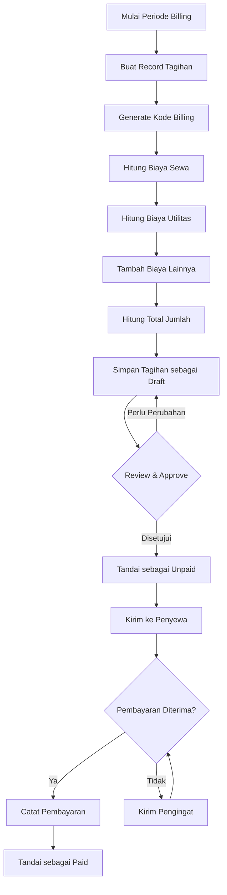
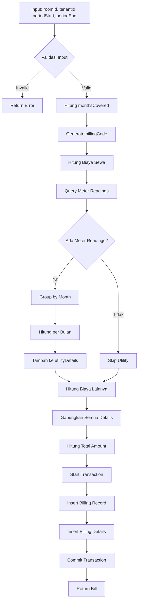

# 🔄 Rencana Refactoring Sistem Billing

> **Tujuan Dokumen**: Dokumen ini menjelaskan rencana refactoring sistem billing untuk mendukung tagihan bulanan terkonsolidasi dengan struktur data yang lebih baik dan kemampuan pelaporan yang lebih akurat.

---

## 📋 Daftar Isi

1. [Gambaran Umum](#gambaran-umum)
2. [Tantangan Saat Ini](#tantangan-saat-ini)
3. [Solusi yang Diusulkan](#solusi-yang-diusulkan)
4. [Perubahan Skema Database](#perubahan-skema-database)
5. [Proses Generate Tagihan](#proses-generate-tagihan)
6. [Contoh Kasus Penggunaan](#contoh-kasus-penggunaan)
7. [Analisis Kelebihan & Kekurangan](#analisis-kelebihan--kekurangan)
8. [Strategi Migrasi](#strategi-migrasi)

---

## 🎯 Gambaran Umum

Sistem billing saat ini memerlukan refactoring untuk mendukung **tagihan bulanan terkonsolidasi** dimana satu tagihan dapat berisi beberapa jenis biaya (sewa, utilitas, dan biaya lainnya). Pendekatan ini akan menyederhanakan proses pembayaran untuk penyewa dan meningkatkan akurasi pelaporan untuk pemilik properti.

### Tujuan Utama

- ✅ Generate satu tagihan komprehensif per penyewa per periode billing
- ✅ Mendukung kalkulasi billing berbasis tanggal yang presisi
- ✅ Melacak berbagai jenis biaya dalam satu tagihan
- ✅ Memungkinkan pelaporan dan pelacakan keuangan yang akurat
- ✅ Mengurangi biaya payment gateway dengan konsolidasi transaksi

---

## 🚧 Tantangan Saat Ini

Sistem billing yang ada menghadapi beberapa keterbatasan:

1. **Banyak tagihan terpisah** untuk berbagai jenis biaya (sewa, utilitas, dll.)
2. **Biaya payment gateway meningkat** karena banyak transaksi
3. **Komunikasi dengan penyewa yang rumit** memerlukan banyak link pembayaran
4. **Pelaporan yang sulit** karena data billing terfragmentasi
5. **Fleksibilitas terbatas** untuk menangani kalkulasi bulan parsial

---

## 💡 Solusi yang Diusulkan

### Pendekatan Billing Terkonsolidasi

Generate **satu tagihan bulanan** yang mencakup:

- 🏠 **Biaya sewa** (dihitung berdasarkan periode hunian)
- ⚡ **Biaya utilitas** (berdasarkan pembacaan meter dalam periode)
- 📦 **Biaya lainnya** (biaya tambahan, layanan, dll.)

### Fitur Utama

- **Pelacakan tanggal presisi** menggunakan format `YYYY-MM-DD`
- **Cakupan periode fleksibel** mendukung bulan parsial
- **Detail tagihan terperinci** untuk transparansi
- **Pelacakan pembayaran terpadu** dengan referensi transaksi tunggal

---

## 🗄️ Perubahan Skema Database

### 1️⃣ **Tabel Billings** (Record Tagihan Utama)

```sql
CREATE TABLE billings (
  id                  SERIAL PRIMARY KEY,
  roomId              INTEGER NOT NULL REFERENCES rooms(id),
  tenantId            INTEGER NOT NULL REFERENCES tenants(id),
  billingCode         VARCHAR(50) UNIQUE NOT NULL,  -- Kode yang mudah dibaca (contoh: "BILL-2026-01-001")
  billStatus          ENUM('draft', 'unpaid', 'paid') DEFAULT 'draft',
  periodStart         DATE NOT NULL,                 -- Tanggal mulai yang tepat (YYYY-MM-DD)
  periodEnd           DATE NOT NULL,                 -- Tanggal akhir yang tepat (YYYY-MM-DD)
  monthsCovered       DECIMAL(5,2) NOT NULL,         -- Bulan yang dicakup (contoh: 1.00, 0.50, 2.00)
  notes               TEXT,
  totalChargedAmount  DECIMAL(12,2) NOT NULL,        -- Total jumlah untuk tagihan ini
  generatedBy         INTEGER REFERENCES users(id),
  createdAt           TIMESTAMP DEFAULT NOW(),
  updatedAt           TIMESTAMP DEFAULT NOW()
);
```

#### 📌 Penjelasan Field

| Field | Tujuan | Contoh |
|-------|--------|--------|
| `billingCode` | Identifier unik yang mudah dibaca | `BILL-2026-01-001` |
| `billStatus` | Status pembayaran saat ini | `draft`, `unpaid`, `paid` |
| `periodStart` | Tanggal mulai periode billing yang tepat | `2026-01-15` |
| `periodEnd` | Tanggal akhir periode billing yang tepat | `2026-02-14` |
| `monthsCovered` | Bulan yang dihitung untuk qty | `1.00` (bulan penuh), `0.50` (setengah bulan) |
| `totalChargedAmount` | Jumlah dari semua detail billing | `1,500,000` |

> **💡 Kenapa Tanggal Exact?**
> - Menghitung periode masuk/keluar penyewa dengan presisi
> - Mengidentifikasi pembacaan meter mana yang termasuk dalam periode billing
> - Mendukung billing prorata untuk bulan parsial

---

### 2️⃣ **Tabel Billing Details** (Item Baris)

```sql
CREATE TABLE billing_details (
  id              SERIAL PRIMARY KEY,
  billId          INTEGER NOT NULL REFERENCES billings(id) ON DELETE CASCADE,
  itemType        ENUM('rent', 'utility', 'others') NOT NULL,
  itemName        VARCHAR(100) NOT NULL,             -- contoh: "Sewa Kamar", "Listrik"
  itemQty         DECIMAL(10,2) NOT NULL,            -- Kuantitas (bulan, kWh, unit)
  itemUnitPrice   DECIMAL(12,2) NOT NULL,            -- Harga per unit
  itemSubAmount   DECIMAL(12,2) NOT NULL,            -- Subtotal sebelum diskon
  itemDiscount    DECIMAL(12,2) DEFAULT 0,           -- Jumlah diskon
  itemTotalAmount DECIMAL(12,2) NOT NULL,            -- Jumlah akhir setelah diskon
  notes           TEXT,
  createdAt       TIMESTAMP DEFAULT NOW(),
  updatedAt       TIMESTAMP DEFAULT NOW()
);
```

#### 📌 Tipe Item

| Tipe | Deskripsi | Contoh Item |
|------|-----------|-------------|
| `rent` | Biaya sewa kamar | Sewa bulanan, deposit |
| `utility` | Konsumsi utilitas | Listrik, air, internet |
| `others` | Biaya tambahan | Biaya kebersihan, maintenance, parkir |

---

### 3️⃣ **Tabel Payments** (Pelacakan Pembayaran)

```sql
CREATE TABLE payments (
  id              SERIAL PRIMARY KEY,
  billId          INTEGER NOT NULL REFERENCES billings(id),
  paymentMethod   ENUM('cash', 'online') NOT NULL,
  paymentAmount   DECIMAL(12,2) NOT NULL,
  paymentDate     DATE NOT NULL,
  paymentProof    VARCHAR(255),                      -- Path file untuk bukti/kuitansi
  processedBy     INTEGER REFERENCES users(id),
  notes           TEXT,
  createdAt       TIMESTAMP DEFAULT NOW(),
  updatedAt       TIMESTAMP DEFAULT NOW()
);
```

> **🔗 Siap Integrasi**: Struktur ini mendukung integrasi dengan payment gateway (Midtrans, dll.)

---

## ⚙️ Proses Generate Tagihan

### 🔄 Alur Kerja Billing Bulanan



---

## 🧮 Algoritma Generate Bill Multi-Bulan

### 📐 Prinsip Dasar

Algoritma ini dirancang untuk menghasilkan satu tagihan yang mencakup **beberapa bulan sekaligus** dengan perhitungan yang akurat untuk setiap komponen biaya.

### 🔢 Langkah-Langkah Algoritma

#### **Step 1: Validasi Input**

Sebelum memproses tagihan, sistem harus memvalidasi:
- ✅ Tanggal akhir harus lebih besar dari tanggal mulai
- ✅ Room dan Tenant harus ada di database
- ✅ Tidak ada tagihan yang overlap untuk periode yang sama
- ✅ Periode billing tidak melebihi batas maksimal yang diizinkan

#### **Step 2: Hitung Jumlah Bulan Tercakup (monthsCovered)**

Formula perhitungan:

| Langkah | Deskripsi | Contoh |
|---------|-----------|--------|
| 1. Hitung total hari | `periodEnd - periodStart + 1` | 90 hari (1 Jan - 31 Mar) |
| 2. Identifikasi bulan dalam periode | Bulan apa saja yang termasuk | Jan, Feb, Mar |
| 3. Hitung total hari dalam bulan | Jumlahkan hari di setiap bulan | 31 + 28 + 31 = 90 |
| 4. Hitung rata-rata hari/bulan | Total hari ÷ jumlah bulan | 90 ÷ 3 = 30 |
| 5. Hitung monthsCovered | Total hari periode ÷ rata-rata | 90 ÷ 30 = **3.00** |

**Contoh Perhitungan:**
- Periode: 1 Januari 2026 - 31 Maret 2026
- Total hari: 90 hari
- Bulan: Januari (31), Februari (28), Maret (31)
- Average: 30 hari per bulan
- **Result: monthsCovered = 3.00**

#### **Step 3: Generate Kode Billing**

Format kode: `BILL-YYYY-MM-XXX`

| Komponen | Deskripsi | Contoh |
|----------|-----------|--------|
| BILL | Prefix tetap | BILL |
| YYYY | Tahun dari periodStart | 2026 |
| MM | Bulan dari periodStart | 01 |
| XXX | Nomor urut (auto-increment) | 001 |

**Contoh:** `BILL-2026-01-001`

#### **Step 4: Hitung Biaya Sewa (Rent)**

Proses kalkulasi:
1. Ambil harga sewa per bulan dari tabel `rooms`
2. Kalikan dengan `monthsCovered`
3. Kurangi dengan diskon (jika ada)
4. Simpan sebagai item dengan `itemType = 'rent'`

**Formula:**
- `Subtotal = Harga Sewa × monthsCovered`
- `Total = Subtotal - Diskon`

**Contoh:**
- Harga sewa: Rp 1,000,000/bulan
- monthsCovered: 3.00
- **Total: Rp 3,000,000**

#### **Step 5: Hitung Biaya Utilitas (Utilities)**

Proses kalkulasi:
1. Query semua `meter_readings` dalam periode `periodStart` sampai `periodEnd`
2. Group meter readings berdasarkan bulan
3. Untuk setiap bulan, hitung total konsumsi: `meterEnd - meterStart`
4. Kalikan dengan harga per kWh dari `settings`
5. Buat satu item billing detail per bulan

**Contoh untuk 3 bulan:**

| Bulan | Konsumsi (kWh) | Harga/kWh | Total |
|-------|----------------|-----------|-------|
| Januari | 100 | Rp 1,500 | Rp 150,000 |
| Februari | 95 | Rp 1,500 | Rp 142,500 |
| Maret | 105 | Rp 1,500 | Rp 157,500 |
| **TOTAL** | **300** | | **Rp 450,000** |

#### **Step 6: Tambah Biaya Lainnya (Others)**

Biaya tambahan yang bisa dimasukkan:

| Jenis Biaya | Tipe Perhitungan | Contoh |
|-------------|------------------|--------|
| Parkir | Per bulan × monthsCovered | Rp 50,000 × 3 = Rp 150,000 |
| Internet | Per bulan × monthsCovered | Rp 100,000 × 3 = Rp 300,000 |
| Maintenance | One-time (qty = 1) | Rp 200,000 × 1 = Rp 200,000 |
| Kebersihan | Per bulan × monthsCovered | Rp 30,000 × 3 = Rp 90,000 |

#### **Step 7: Hitung Total dan Simpan**

Proses akhir:
1. Gabungkan semua billing details (rent + utilities + others)
2. Hitung `totalChargedAmount` = sum dari semua `itemTotalAmount`
3. Buka database transaction
4. Insert record ke tabel `billings`
5. Insert semua details ke tabel `billing_details`
6. Commit transaction
7. Return bill yang sudah dibuat

### 📊 Flowchart Algoritma Multi-Bulan



### 🎯 Contoh Kalkulasi Lengkap

#### **Skenario: Tagihan 3 Bulan (Jan-Mar 2026)**

**Data Input:**
- Room ID: 101
- Tenant ID: 5
- Periode: 1 Januari 2026 - 31 Maret 2026
- User ID: 1 (yang generate)

**Proses Step-by-Step:**

| Step | Proses | Hasil |
|------|--------|-------|
| 1 | Validasi input | ✅ Valid |
| 2 | Hitung monthsCovered | **3.00** bulan |
| 3 | Generate billing code | **BILL-2026-01-001** |
| 4 | Hitung rent (Rp 1,000,000 × 3) | **Rp 3,000,000** |
| 5a | Hitung listrik Jan (100 kWh × Rp 1,500) | **Rp 150,000** |
| 5b | Hitung listrik Feb (95 kWh × Rp 1,500) | **Rp 142,500** |
| 5c | Hitung listrik Mar (105 kWh × Rp 1,500) | **Rp 157,500** |
| 6 | Hitung parkir (Rp 50,000 × 3) | **Rp 150,000** |
| 7 | **GRAND TOTAL** | **Rp 3,600,000** |

**Breakdown Tagihan:**

| Kategori | Detail | Jumlah |
|----------|--------|--------|
| 🏠 **Sewa** | Sewa Kamar (3 bulan) | Rp 3,000,000 |
| ⚡ **Utilitas** | Listrik Januari | Rp 150,000 |
| | Listrik Februari | Rp 142,500 |
| | Listrik Maret | Rp 157,500 |
| 📦 **Lainnya** | Parkir (3 bulan) | Rp 150,000 |
| | **TOTAL TAGIHAN** | **Rp 3,600,000** |

### ⚠️ Edge Cases yang Ditangani

| Edge Case | Solusi | Contoh |
|-----------|--------|--------|
| **Bulan dengan hari berbeda** | Gunakan average days per month dalam periode | Feb (28) vs Jan (31) → rata-rata |
| **Tidak ada meter reading** | Skip utility charges atau gunakan estimasi | Buat warning untuk admin |
| **Periode lintas tahun** | Tetap hitung normal, monthsCovered akan akurat | Des 2025 - Feb 2026 = 3 bulan |
| **Tenant pindah tengah periode** | Gunakan periodEnd sesuai tanggal keluar | Masuk 1 Jan, keluar 15 Feb |
| **Duplikasi periode** | Validasi sebelum generate, cek overlap periode | Error jika sudah ada bill |
| **Pembacaan meter tidak lengkap** | Flag warning, admin bisa manual input | Hanya ada 2 dari 3 bulan |

### 🔍 Validasi Kualitas Data

Setelah bill dibuat, sistem harus melakukan quality check:

| Validasi | Kondisi | Warning |
|----------|---------|---------|
| **Utility Check** | Periode ≥ 1 bulan tapi tidak ada utility | "Tidak ada biaya utilitas untuk periode ≥ 1 bulan" |
| **monthsCovered Check** | Selisih dengan expected > 0.5 bulan | "monthsCovered mungkin tidak akurat" |
| **Total Amount Check** | Total tagihan ≤ 0 | "Total tagihan ≤ 0" |
| **Meter Reading Check** | Jumlah meter reading < jumlah bulan | "Pembacaan meter tidak lengkap" |

---

## 📊 Contoh Kasus Penggunaan

### 📅 **Kasus 1: Billing Bulan Penuh**

**Skenario**: Penyewa menempati kamar untuk seluruh bulan Januari 2026

#### Data Input
- **Periode**: `2026-01-01` sampai `2026-01-31`
- **Bulan Tercakup**: `1.00`
- **Sewa Kamar**: Rp 1,000,000/bulan
- **Pembacaan Meter**: 100 kWh @ Rp 1,500/kWh

#### Tagihan yang Dihasilkan

**Record Billing**
```json
{
  "billingCode": "BILL-2026-01-001",
  "roomId": 101,
  "tenantId": 5,
  "billStatus": "unpaid",
  "periodStart": "2026-01-01",
  "periodEnd": "2026-01-31",
  "monthsCovered": 1.00,
  "totalChargedAmount": 1150000,
  "generatedBy": 1
}
```

**Detail Billing**

| Tipe Item | Nama Item | Qty | Harga Unit | Subtotal | Diskon | Total |
|-----------|-----------|-----|------------|----------|--------|-------|
| `rent` | Sewa Kamar - Januari | 1.00 | 1,000,000 | 1,000,000 | 0 | 1,000,000 |
| `utility` | Listrik (100 kWh) | 100 | 1,500 | 150,000 | 0 | 150,000 |
| | | | | | **TOTAL** | **1,150,000** |

---

### 📅 **Kasus 2: Billing Bulan Parsial (Masuk Pertengahan Bulan)**

**Skenario**: Penyewa masuk tanggal 15 Januari 2026

#### Data Input
- **Periode**: `2026-01-15` sampai `2026-01-31`
- **Hari dalam Periode**: 17 hari
- **Hari dalam Januari**: 31 hari
- **Bulan Tercakup**: `17/31 = 0.55`
- **Sewa Kamar**: Rp 1,000,000/bulan
- **Pembacaan Meter**: 50 kWh @ Rp 1,500/kWh

#### Tagihan yang Dihasilkan

**Record Billing**
```json
{
  "billingCode": "BILL-2026-01-002",
  "periodStart": "2026-01-15",
  "periodEnd": "2026-01-31",
  "monthsCovered": 0.55,
  "totalChargedAmount": 625000
}
```

**Detail Billing**

| Tipe Item | Nama Item | Qty | Harga Unit | Subtotal | Diskon | Total |
|-----------|-----------|-----|------------|----------|--------|-------|
| `rent` | Sewa Kamar (Prorata) | 0.55 | 1,000,000 | 550,000 | 0 | 550,000 |
| `utility` | Listrik (50 kWh) | 50 | 1,500 | 75,000 | 0 | 75,000 |
| | | | | | **TOTAL** | **625,000** |

---

### 📅 **Kasus 3: Billing Multi-Bulan**

**Skenario**: Generate tagihan untuk 3 bulan (Jan-Mar 2026)

#### Data Input
- **Periode**: `2026-01-01` sampai `2026-03-31`
- **Bulan Tercakup**: `3.00`
- **Sewa Kamar**: Rp 1,000,000/bulan
- **Pembacaan Meter**: 
  - Januari: 100 kWh
  - Februari: 95 kWh
  - Maret: 105 kWh
  - **Total**: 300 kWh @ Rp 1,500/kWh

#### Tagihan yang Dihasilkan

**Detail Billing**

| Tipe Item | Nama Item | Qty | Harga Unit | Subtotal | Diskon | Total |
|-----------|-----------|-----|------------|----------|--------|-------|
| `rent` | Sewa Kamar (3 bulan) | 3.00 | 1,000,000 | 3,000,000 | 0 | 3,000,000 |
| `utility` | Listrik - Jan (100 kWh) | 100 | 1,500 | 150,000 | 0 | 150,000 |
| `utility` | Listrik - Feb (95 kWh) | 95 | 1,500 | 142,500 | 0 | 142,500 |
| `utility` | Listrik - Mar (105 kWh) | 105 | 1,500 | 157,500 | 0 | 157,500 |
| | | | | | **TOTAL** | **3,450,000** |

---

## ⚖️ Analisis Kelebihan & Kekurangan

### ✅ **Kelebihan (PROS)**

| Manfaat | Dampak | Detail |
|---------|--------|--------|
| 📊 **Pelaporan Lebih Baik** | Tinggi | Data terkonsolidasi membuat pelaporan keuangan lebih akurat dan mudah dihasilkan |
| 💰 **Biaya Pembayaran Berkurang** | Sedang | Satu transaksi per penyewa mengurangi biaya payment gateway |
| 📱 **Komunikasi Lebih Sederhana** | Tinggi | Satu link WhatsApp per penyewa daripada banyak permintaan pembayaran |
| 🎯 **Kalkulasi Akurat** | Tinggi | Pelacakan tanggal presisi memungkinkan billing prorata dan kalkulasi utilitas yang tepat |
| 🔍 **Transparansi Meningkat** | Sedang | Tagihan terperinci menunjukkan rincian jelas semua biaya |
| 🏗️ **Skalabilitas** | Tinggi | Struktur mendukung fitur masa depan (diskon, promosi, dll.) |
| 📈 **Pelacakan Cash Flow Lebih Baik** | Tinggi | Visibilitas jelas tagihan yang belum dibayar vs. yang sudah dibayar |

### ⚠️ **Kekurangan (CONS)**

| Tantangan | Dampak | Strategi Mitigasi |
|-----------|--------|-------------------|
| 🔨 **Usaha Refactoring** | Tinggi | Pendekatan migrasi bertahap dengan testing menyeluruh |
| 📚 **Migrasi Data** | Sedang | Buat script migrasi dengan kemampuan rollback |
| 🧪 **Kompleksitas Testing** | Sedang | Test case komprehensif untuk semua skenario billing |
| 👥 **Pelatihan User** | Rendah | Update dokumentasi dan berikan pelatihan staff |
| ⏱️ **Waktu Development** | Sedang | Alokasikan waktu cukup untuk implementasi dan testing |

---

## 🚀 Strategi Migrasi

### Fase 1: Persiapan (Minggu 1-2)

- [ ] **Review & Approve** rencana refactoring ini
- [ ] **Backup** database yang ada
- [ ] **Buat** skema database baru di environment development
- [ ] **Develop** script migrasi
- [ ] **Test** script migrasi dengan data sampel

### Fase 2: Implementasi (Minggu 3-4)

- [ ] **Update** skema database
- [ ] **Migrate** data billing yang ada
- [ ] **Implement** logika generate billing baru
- [ ] **Update** API endpoints
- [ ] **Modifikasi** komponen frontend

### Fase 3: Testing (Minggu 5)

- [ ] **Unit tests** untuk kalkulasi billing
- [ ] **Integration tests** untuk API endpoints
- [ ] **User acceptance testing** dengan skenario sampel
- [ ] **Performance testing** dengan dataset besar

### Fase 4: Deployment (Minggu 6)

- [ ] **Deploy** ke staging environment
- [ ] **Final testing** dengan skenario real-world
- [ ] **Train** staff pada sistem baru
- [ ] **Deploy** ke production
- [ ] **Monitor** performa sistem

---

## 📝 Checklist Implementasi

### Perubahan Database
- [ ] Buat tabel `billings` dengan struktur baru
- [ ] Buat tabel `billing_details`
- [ ] Buat tabel `payments`
- [ ] Tambah indexes untuk optimasi performa
- [ ] Buat database triggers untuk field `updatedAt`

### Logika Bisnis
- [ ] Implement generator kode billing
- [ ] Buat fungsi kalkulasi sewa (dengan proration)
- [ ] Buat fungsi kalkulasi utilitas (agregasi pembacaan meter)
- [ ] Implement kalkulator total amount
- [ ] Tambah validasi untuk periode billing

### API Endpoints
- [ ] `POST /api/bills/generate` - Generate tagihan baru
- [ ] `GET /api/bills/:id` - Ambil detail tagihan
- [ ] `PUT /api/bills/:id` - Update tagihan
- [ ] `DELETE /api/bills/:id` - Hapus tagihan draft
- [ ] `POST /api/bills/:id/payment` - Catat pembayaran
- [ ] `GET /api/bills` - List tagihan dengan filter

### Update Frontend
- [ ] Form generate tagihan
- [ ] Tampilan detail tagihan
- [ ] Interface pencatatan pembayaran
- [ ] Listing tagihan dengan filter
- [ ] Fungsi print/export tagihan

### Dokumentasi
- [ ] Dokumentasi API
- [ ] Manual pengguna
- [ ] Panduan admin
- [ ] Panduan migrasi

---

## 🎨 Contoh Tampilan Tagihan

### Preview Tagihan yang Dihasilkan

```
╔══════════════════════════════════════════════════════════════╗
║                    TAGIHAN KOST / BILL                       ║
╠══════════════════════════════════════════════════════════════╣
║  Nomor Tagihan: BILL-2026-01-001                            ║
║  Periode: 01 Januari 2026 - 31 Januari 2026                ║
║  Status: BELUM DIBAYAR                                       ║
╠══════════════════════════════════════════════════════════════╣
║  Penyewa: John Doe                                           ║
║  Kamar: Room 101 - Deluxe                                    ║
╠══════════════════════════════════════════════════════════════╣
║  RINCIAN TAGIHAN                                             ║
╠══════════════════════════════════════════════════════════════╣
║  1. Sewa Kamar (1 bulan)                                     ║
║     1.00 x Rp 1,000,000                    Rp   1,000,000   ║
║                                                               ║
║  2. Listrik (100 kWh)                                        ║
║     100 x Rp 1,500                         Rp     150,000   ║
║                                                               ║
║  3. Air (10 m³)                                              ║
║     10 x Rp 5,000                          Rp      50,000   ║
╠══════════════════════════════════════════════════════════════╣
║  TOTAL TAGIHAN                             Rp   1,200,000   ║
╚══════════════════════════════════════════════════════════════╝

Silakan lakukan pembayaran melalui:
💳 Transfer Bank: BCA 1234567890 (a.n. Pemilik Kost)
💰 Cash: Hubungi admin
🔗 Online: [Link Pembayaran]
```

---

## 🔗 Dokumen Terkait

- [Rencana Implementasi](./IMPLEMENTATION_PLAN.md)
- [Dokumentasi Skema Database](./DATABASE_SCHEMA.md)
- [Dokumentasi API](./API_DOCUMENTATION.md)

---

## 📞 Pertanyaan & Feedback

Jika Anda memiliki pertanyaan atau saran terkait rencana refactoring ini, silakan diskusikan dengan tim development sebelum melanjutkan implementasi.

---

**Versi Dokumen**: 1.0  
**Terakhir Diupdate**: 2026-01-18  
**Status**: 📋 Menunggu Review
