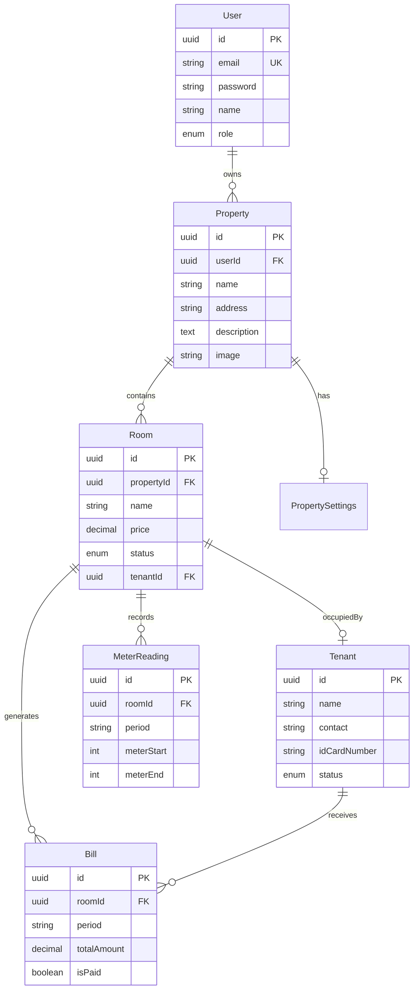

# Kos-Man Database & Backend Implementation Plan

> **Version:** 1.1  
> **Date:** 15 Januari 2026  
> **Status:** Reviewed

---

## 📋 Executive Summary

Dokumen ini berisi rancangan database schema dan backend API untuk sistem **Kos-Man** (Kos Management System). Rancangan dibuat berdasarkan analisis frontend Vue/Nuxt yang sudah ada.

### Scope

- Database schema design (PostgreSQL + Drizzle ORM)
- Backend API endpoints (Nuxt Server API)
- Authentication system

### Out of Scope (untuk fase ini)

- Payment gateway integration
- Mobile application
- Push notifications

---

## 🗄️ Database Design

### Technology Stack

| Component | Technology          | Rationale                        |
| --------- | ------------------- | -------------------------------- |
| Database  | PostgreSQL          | Reliable, scalable, JSON support |
| ORM       | Drizzle ORM         | Type-safe, lightweight, SQL-like |
| Runtime   | Nuxt Server (Nitro) | Already in use                   |

### Entity Relationship Diagram

---

## 📊 Database Tables

### 1. User

Pengguna sistem (pemilik/pengelola kos).

| Field     | Type         | Constraint       | Description               |
| --------- | ------------ | ---------------- | ------------------------- |
| id        | UUID         | PK               | Primary key               |
| email     | VARCHAR(255) | UNIQUE, NOT NULL | Email login               |
| password  | VARCHAR(255) | NOT NULL         | Hashed password           |
| name      | VARCHAR(255) | NOT NULL         | Nama lengkap              |
| role      | ENUM         | DEFAULT 'owner'  | `owner`, `admin`, `staff` |
| createdAt | TIMESTAMP    | DEFAULT now()    | -                         |
| updatedAt | TIMESTAMP    | auto             | -                         |

### 2. Property

Properti kos yang dikelola.

| Field       | Type         | Constraint    | Description         |
| ----------- | ------------ | ------------- | ------------------- |
| id          | UUID         | PK            | Primary key         |
| userId      | UUID         | FK → User     | Pemilik             |
| name        | VARCHAR(255) | NOT NULL      | Nama properti       |
| address     | TEXT         | NOT NULL      | Alamat lengkap      |
| description | TEXT         | NULLABLE      | Deskripsi fasilitas |
| image       | VARCHAR(500) | NULLABLE      | URL gambar cover    |
| mapUrl      | VARCHAR(500) | NULLABLE      | URL embed map       |
| createdAt   | TIMESTAMP    | DEFAULT now() | -                   |
| updatedAt   | TIMESTAMP    | auto          | -                   |

### 3. PropertySettings

Setting tarif khusus per properti (opsional).

| Field      | Type          | Constraint            | Description        |
| ---------- | ------------- | --------------------- | ------------------ |
| id         | UUID          | PK                    | Primary key        |
| propertyId | UUID          | FK → Property, UNIQUE | 1:1 relation       |
| costPerKwh | DECIMAL(10,2) | NOT NULL              | Rp/kWh             |
| waterFee   | DECIMAL(12,2) | NOT NULL              | Biaya air/bulan    |
| trashFee   | DECIMAL(12,2) | NOT NULL              | Biaya sampah/bulan |

### 4. Room

Kamar dalam properti.

| Field           | Type          | Constraint            | Description                            |
| --------------- | ------------- | --------------------- | -------------------------------------- |
| id              | UUID          | PK                    | Primary key                            |
| propertyId      | UUID          | FK → Property         | Properti induk                         |
| name            | VARCHAR(100)  | NOT NULL              | Nomor kamar                            |
| price           | DECIMAL(12,2) | NOT NULL              | Harga sewa/bulan                       |
| status          | ENUM          | DEFAULT 'available'   | `available`, `occupied`, `maintenance` |
| tenantId        | UUID          | FK → Tenant, NULLABLE | Penghuni saat ini                      |
| useTrashService | BOOLEAN       | DEFAULT true          | Pakai layanan sampah                   |
| moveInDate      | DATE          | NULLABLE              | Tanggal masuk (prorate)                |

**Constraint:** `UNIQUE(propertyId, name)`

### 5. Tenant

Data penyewa/penghuni.

| Field        | Type         | Constraint       | Description          |
| ------------ | ------------ | ---------------- | -------------------- |
| id           | UUID         | PK               | Primary key          |
| name         | VARCHAR(255) | NOT NULL         | Nama lengkap         |
| contact      | VARCHAR(20)  | NOT NULL         | No. telepon          |
| idCardNumber | VARCHAR(16)  | NOT NULL         | No. KTP (16 digit)   |
| status       | ENUM         | DEFAULT 'active' | `active`, `inactive` |

### 6. MeterReading

Pembacaan meter listrik.

| Field      | Type       | Constraint | Description      |
| ---------- | ---------- | ---------- | ---------------- |
| id         | UUID       | PK         | Primary key      |
| roomId     | UUID       | FK → Room  | Kamar            |
| period     | VARCHAR(7) | NOT NULL   | Format: YYYY-MM  |
| meterStart | INT        | NOT NULL   | Angka awal       |
| meterEnd   | INT        | NOT NULL   | Angka akhir      |
| recordedAt | TIMESTAMP  | NOT NULL   | Waktu pencatatan |

**Constraint:** `UNIQUE(roomId, period)`, `CHECK(meterEnd >= meterStart)`

### 7. Bill

Tagihan bulanan (support multi-month payment).

| Field          | Type          | Constraint            | Description                 |
| -------------- | ------------- | --------------------- | --------------------------- |
| id             | UUID          | PK                    | Primary key                 |
| roomId         | UUID          | FK → Room             | Kamar                       |
| tenantId       | UUID          | FK → Tenant, NULLABLE | Penghuni                    |
| period         | VARCHAR(7)    | NOT NULL              | Periode awal (YYYY-MM)      |
| periodEnd      | VARCHAR(7)    | NULLABLE              | Periode akhir jika multi-mo |
| monthsCovered  | INT           | DEFAULT 1             | Jumlah bulan dibayar        |
| meterStart     | INT           | NOT NULL              | Snapshot meter awal         |
| meterEnd       | INT           | NOT NULL              | Snapshot meter akhir        |
| costPerKwh     | DECIMAL(10,2) | NOT NULL              | Snapshot tarif/kWh          |
| roomPrice      | DECIMAL(12,2) | NOT NULL              | Total harga sewa (x bulan)  |
| usageCost      | DECIMAL(12,2) | NOT NULL              | Biaya listrik               |
| waterFee       | DECIMAL(12,2) | NOT NULL              | Snapshot biaya air          |
| trashFee       | DECIMAL(12,2) | NOT NULL              | Snapshot biaya sampah       |
| additionalCost | DECIMAL(12,2) | DEFAULT 0             | Biaya lain-lain             |
| totalAmount    | DECIMAL(12,2) | NOT NULL              | Total tagihan               |
| isPaid         | BOOLEAN       | DEFAULT false         | Status bayar                |
| paidAt         | TIMESTAMP     | NULLABLE              | Waktu pembayaran            |
| generatedAt    | TIMESTAMP     | NOT NULL              | Waktu generate              |

### 8. GlobalSettings

Setting default per user.

| Field      | Type          | Constraint        | Description          |
| ---------- | ------------- | ----------------- | -------------------- |
| id         | UUID          | PK                | Primary key          |
| userId     | UUID          | FK → User, UNIQUE | 1:1 per user         |
| costPerKwh | DECIMAL(10,2) | DEFAULT 1500      | Default Rp/kWh       |
| waterFee   | DECIMAL(12,2) | DEFAULT 50000     | Default air/bulan    |
| trashFee   | DECIMAL(12,2) | DEFAULT 25000     | Default sampah/bulan |

---

## 🔌 API Endpoints (Proposed)

### Authentication

| Method | Endpoint             | Description       |
| ------ | -------------------- | ----------------- |
| POST   | `/api/auth/register` | Register new user |
| POST   | `/api/auth/login`    | Login             |
| POST   | `/api/auth/logout`   | Logout            |
| GET    | `/api/auth/me`       | Get current user  |

### Properties

| Method | Endpoint              | Description         |
| ------ | --------------------- | ------------------- |
| GET    | `/api/properties`     | List all properties |
| POST   | `/api/properties`     | Create property     |
| GET    | `/api/properties/:id` | Get property detail |
| PUT    | `/api/properties/:id` | Update property     |
| DELETE | `/api/properties/:id` | Delete property     |

### Rooms

| Method | Endpoint                    | Description            |
| ------ | --------------------------- | ---------------------- |
| GET    | `/api/rooms?propertyId=:id` | List rooms by property |
| POST   | `/api/rooms`                | Create room            |
| GET    | `/api/rooms/:id`            | Get room detail        |
| PUT    | `/api/rooms/:id`            | Update room            |
| DELETE | `/api/rooms/:id`            | Delete room            |

### Tenants

| Method | Endpoint           | Description       |
| ------ | ------------------ | ----------------- |
| GET    | `/api/tenants`     | List all tenants  |
| POST   | `/api/tenants`     | Create tenant     |
| GET    | `/api/tenants/:id` | Get tenant detail |
| PUT    | `/api/tenants/:id` | Update tenant     |
| DELETE | `/api/tenants/:id` | Delete tenant     |

### Meter Readings

| Method | Endpoint                         | Description           |
| ------ | -------------------------------- | --------------------- |
| GET    | `/api/meter-readings?roomId=:id` | List readings by room |
| POST   | `/api/meter-readings`            | Record new reading    |
| DELETE | `/api/meter-readings/:id`        | Delete reading        |

### Bills

| Method | Endpoint              | Description                   |
| ------ | --------------------- | ----------------------------- |
| GET    | `/api/bills`          | List all bills (with filters) |
| POST   | `/api/bills/generate` | Generate new bill             |
| PATCH  | `/api/bills/:id/pay`  | Mark bill as paid             |
| DELETE | `/api/bills/:id`      | Delete bill                   |

### Settings

| Method | Endpoint        | Description            |
| ------ | --------------- | ---------------------- |
| GET    | `/api/settings` | Get global settings    |
| PUT    | `/api/settings` | Update global settings |

---

## 🚀 Implementation Phases

### Phase 1: Database Setup (1-2 days)

- [ ] Install Drizzle ORM, Drizzle Kit & dependencies
- [ ] Create `drizzle.config.ts`
- [ ] Create `server/database/schema.ts`
- [ ] Setup PostgreSQL database
- [ ] Run migrations using `drizzle-kit`
- [ ] Setup Drizzle DB instance connection

### Phase 2: Auth & User (2-3 days)

- [ ] Implement auth endpoints
- [ ] JWT/session handling
- [ ] Middleware for protected routes
- [ ] Password hashing (bcrypt)

### Phase 3: Core CRUD (3-4 days)

- [ ] Property APIs
- [ ] Room APIs
- [ ] Tenant APIs
- [ ] Settings APIs

### Phase 4: Billing (2-3 days)

- [ ] Meter reading APIs
- [ ] Bill generation API
- [ ] Bill payment API
- [ ] Proration calculation

### Phase 5: Frontend Integration (2-3 days)

- [ ] Replace localStorage with API calls
- [ ] Add auth flow (login/logout)
- [ ] Error handling
- [ ] Loading states

---

## ✅ Keputusan Teknis

| Question         | Decision                    | Notes                                                  |
| ---------------- | --------------------------- | ------------------------------------------------------ |
| Database hosting | **PostgreSQL Lokal**        | Self-hosted, dapat di-migrate ke cloud jika dibutuhkan |
| Auth method      | **Simple JWT**              | Stateless, mudah di-scale                              |
| Multi-tenant     | **Single owner (scalable)** | Design sudah support multi-owner untuk future SaaS     |
| Fitur tambahan   | **Multi-month payment**     | Support bayar 2 bulan atau lebih sekaligus             |

### Catatan Design untuk Multi-Month Payment

Untuk mendukung pembayaran multiple bulan sekaligus, ditambahkan field pada tabel **Bill**:

| Field           | Type       | Description                              |
| --------------- | ---------- | ---------------------------------------- |
| `monthsCovered` | INT        | Jumlah bulan yang dibayar (default: 1)   |
| `periodEnd`     | VARCHAR(7) | Periode akhir jika multi-bulan (YYYY-MM) |

**Contoh:** Tenant bayar untuk Januari-Maret 2026

- `period`: "2026-01"
- `periodEnd`: "2026-03"
- `monthsCovered`: 3
- `roomPrice`: Rp 4.500.000 (3 x Rp 1.500.000)

---

## 📝 Revision History

| Date       | Version | Author       | Changes       |
| ---------- | ------- | ------------ | ------------- |
| 2026-01-14 | 1.0     | AI Assistant | Initial draft |
| 2026-01-15 | 1.1     | Gunawan      | Update        |

---

**Review requested from:** Development Team  
**Approval needed by:** Project Lead
